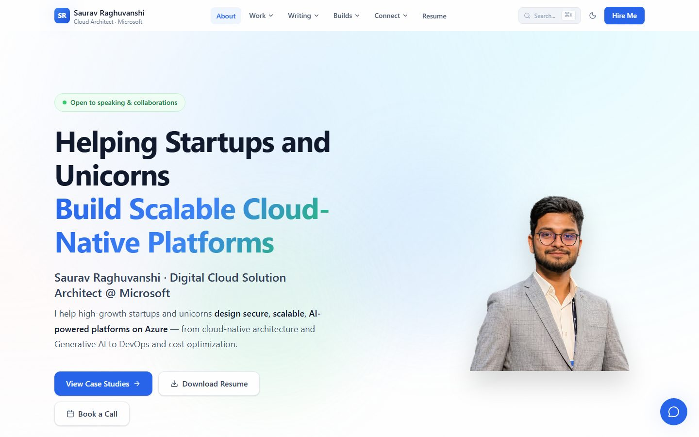
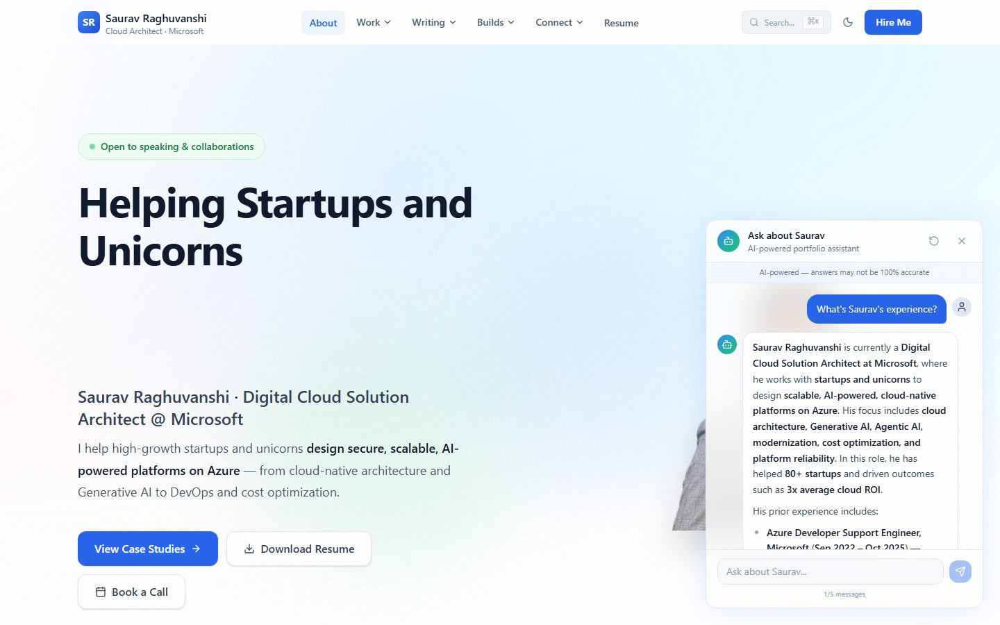
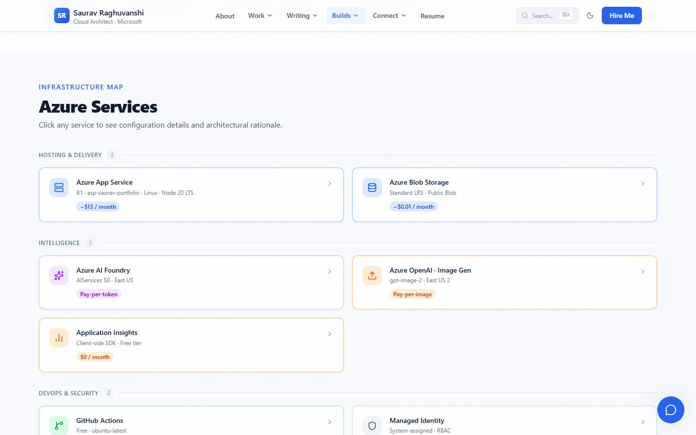
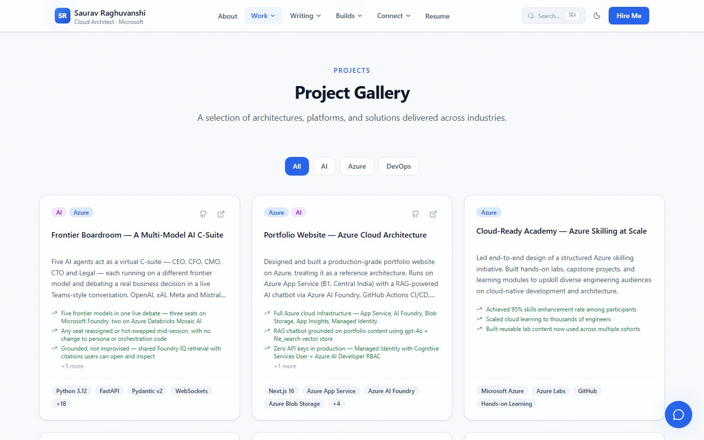
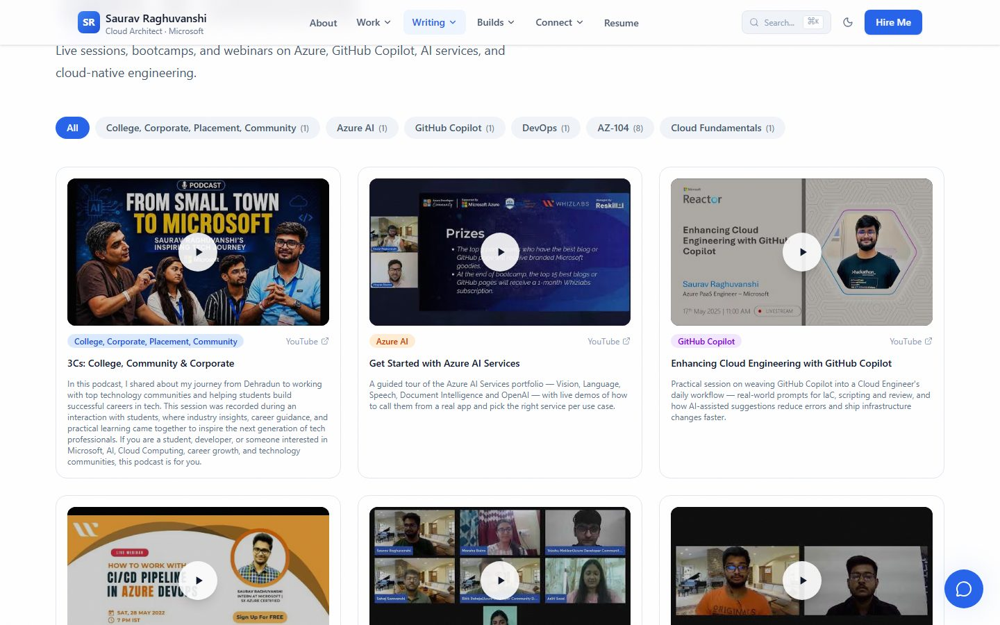
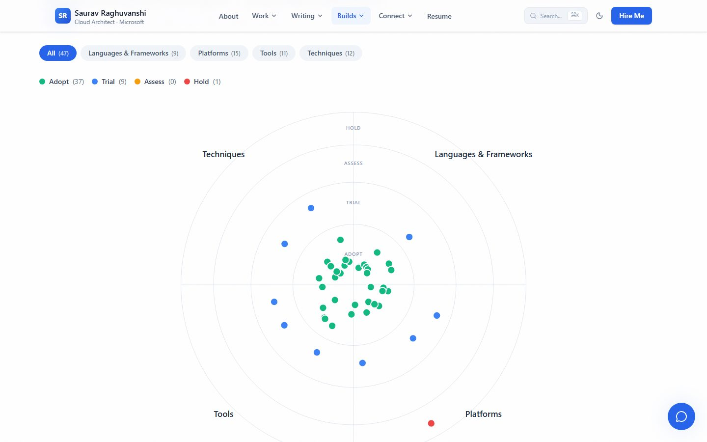

<div align="center">

# Saurav Raghuvanshi — Portfolio

**A production portfolio platform for a cloud architect — with a built-in CMS, an AI assistant grounded in its own content, an Azure architecture advisor, and a live map of the infrastructure it runs on.**

[**Visit the live site →**](https://saurav-portfolio.azurewebsites.net)

[](https://github.com/sauravraghuvanshi/portfolio/actions/workflows/deploy.yml)
[](https://nextjs.org)
[](https://www.typescriptlang.org)
[](https://azure.microsoft.com/products/app-service)



</div>

---

## What this is

Most developer portfolios are a résumé with a nicer font. This one is a small product.

It's the personal site of **Saurav Raghuvanshi**, a Digital Cloud Solution Architect at Microsoft — but the interesting part is what sits behind it:

- **Nothing here is hardcoded.** Every project, talk, blog post, case study, certification, architecture decision and tech-radar entry is editable from a password-protected admin panel that writes to the server's persistent storage. Publishing doesn't require a commit or a redeploy.
- **The chatbot actually knows things.** It answers questions about the owner's background using retrieval over that same content, so it stays accurate as the content changes.
- **It explains its own infrastructure.** A dedicated page renders the real Azure services the site runs on, with tiers and monthly costs — because a cloud architect's portfolio should be able to account for itself.
- **It gives away the reasoning.** A public ADR gallery documents the architectural decisions made while building it, trade-offs included.

### Who it's for

| If you are… | What's here for you |
|---|---|
| **Hiring or evaluating** | A worked example of Next.js 16 App Router, Server Components, streaming AI and a real Azure deployment pipeline — not a tutorial app |
| **Building your own portfolio** | Fork it. [Deploy your own](#deploy-your-own) walks through standing up the entire stack on Azure from scratch |
| **Learning Azure + AI integration** | End-to-end Azure AI Foundry agent with RAG, managed-identity auth and blob-backed image generation |
| **Planning an Azure workload** | The [Architecture Advisor](https://saurav-portfolio.azurewebsites.net/advisor) is free and needs no sign-in |

<!-- SYNC:STATS:START -->
<!-- Auto-generated by scripts/sync-docs.mjs — do not edit by hand -->

## Content at a Glance

| Area | Count |
|---|---|
| Certifications | 12 |
| Projects | 9 |
| Case Studies | 3 |
| Blog Posts | 5 |
| YouTube Talks | 13 |
| Events | 33 |
| Speaking Engagements | 4 |

_Last synced: 2026-08-09_

<!-- SYNC:STATS:END -->

---

## Features

### 🧭 AI Architecture Advisor

Describe an Azure workload — or take a tailored questionnaire — and get back a **Microsoft Well-Architected Framework scorecard**: risks, recommended Azure services and citations to Microsoft Learn under each of the five pillars. The result exports as a ready-to-commit ADR in Markdown.

It runs on an Azure AI Foundry agent wired to the **Microsoft Learn MCP server**, so the guidance cites current first-party documentation rather than model recollection. Free, no sign-in, rate-limited per IP.

### 🤖 AI assistant



A chat widget on every page, backed by an Azure AI Foundry agent with a retrieval vector store built from the site's own content. Ask about experience, projects or certifications and it answers from indexed source material instead of guessing. Responses stream token by token; each visitor gets five messages per session.

The same AI layer powers an **AI Writer** in the admin panel that drafts blog posts, case studies and project entries in MDX — and generates cover images inline through Azure OpenAI, uploading them to Blob Storage and injecting the URLs back into the draft.

### ☁️ Live infrastructure map



A rendered inventory of every Azure service behind the site — grouped into Hosting & Delivery, Intelligence, and DevOps & Security — each with its SKU, region and actual monthly cost, alongside request-flow and CI/CD diagrams. It doubles as a reference architecture for anyone deploying a similar stack.

### 📂 Project gallery



Filterable by category, with every project rendering through one shared card component. Each opens to a full detail page covering the problem, the architecture and the measured outcome.

### 🎙️ Talks & community



An archive of recorded sessions with topic filters and lazy-loaded YouTube embeds (thumbnail first, iframe only on click), plus an events timeline with photo galleries and an interactive map of speaking engagements across India.

### 📡 Tech radar



A ThoughtWorks-style radar placing languages, platforms, tools and techniques into Adopt / Trial / Assess / Hold rings — drawn as custom SVG with no chart library, and with an accessible list view rendered beneath it. Each entry opens a drawer explaining when to use it, when to avoid it, and how its position has moved.

### ✍️ Admin panel & content pipeline

A NextAuth-protected CMS at `/admin` with full create / edit / publish-or-draft control over **eight content types**: blog posts, case studies, projects, talks, events, certifications, tech-radar entries and architecture decision records. Markdown editing with live preview, drag-and-drop image upload to Azure Blob Storage, and one-click rebuilds of the AI assistant's search index after publishing.

Because the admin writes to the App Service's persistent volume rather than the repo, **content changes go live immediately** — no build, no deploy. A CI step and the `npm run pull:live` script sync that content back into the repository so the two never drift.

### 🧩 Everywhere else

- **⌘K command palette** — fuzzy search across every page and content item
- **Dark mode** — system-aware, with no flash on first paint
- **Reading experience** — MDX with syntax highlighting, copy-to-clipboard code blocks, reading-time estimates, scroll-spy table of contents and related posts
- **Feeds & SEO** — RSS, dynamic sitemap, `robots.txt`, OpenGraph/Twitter cards and JSON-LD structured data
- **Motion** — Framer Motion page transitions and scroll animations, fully honouring `prefers-reduced-motion`
- **Résumé & social** — an interactive career timeline with PDF download, plus a consolidated social directory

---

## Tech stack

| Layer | Technology |
|---|---|
| **Framework** | Next.js 16 (App Router, React Server Components, `output: "standalone"`) |
| **Language** | TypeScript, strict mode |
| **UI** | React 19 · Tailwind CSS v4 (CSS-first `@theme` tokens) · Framer Motion · Lucide icons |
| **Content** | MDX (`next-mdx-remote`, `gray-matter`, `remark-gfm`) + JSON, validated with Zod |
| **AI** | Vercel AI SDK v6 · Azure AI Foundry agent (RAG vector store, Web Search, Microsoft Learn MCP) · Azure OpenAI for image generation |
| **Auth** | NextAuth v5 — credentials provider, JWT sessions, middleware-protected routes |
| **Hosting** | Azure App Service (B1, Linux, Node 20 LTS) |
| **Storage** | Azure Blob Storage for uploaded media |
| **Telemetry** | Azure Application Insights (client-side) |
| **CI/CD** | GitHub Actions → standalone zip → Kudu ZipDeploy |
| **Quality** | Playwright E2E · ESLint · `tsc --noEmit` |

---

## Run it locally

**Prerequisites:** Node.js 20+ and npm.

```bash
git clone https://github.com/sauravraghuvanshi/portfolio.git
cd portfolio
npm install
cp .env.example .env.local     # fill in only what you need
npm run dev
```

Open <http://localhost:3000>.

**The site runs with an empty `.env.local`.** Every integration degrades gracefully — without Azure credentials the chatbot, advisor and AI Writer are unavailable and image upload is disabled, but all public pages, content and navigation work normally. Add variables only for the features you actually want.

### Environment variables

| Variable | Needed for | Notes |
|---|---|---|
| `NEXT_PUBLIC_SITE_URL` | Canonical URLs, sitemap, OG tags | Defaults to localhost in dev |
| `ADMIN_USERNAME` / `ADMIN_PASSWORD` | `/admin` sign-in | Choose your own |
| `AUTH_SECRET` | NextAuth session signing | `openssl rand -base64 32` |
| `AUTH_TRUST_HOST` | Auth behind a proxy | `true` in production |
| `AZURE_OPENAI_ENDPOINT` / `AZURE_OPENAI_API_KEY` | Chatbot, advisor, AI Writer | From your Azure AI Foundry resource |
| `AZURE_OPENAI_DEPLOYMENT` | Chatbot, advisor, AI Writer | Your chat model deployment name |
| `AZURE_FOUNDRY_PROJECT_ENDPOINT` / `AZURE_FOUNDRY_AGENT_NAME` | Agent-backed features | Foundry project + agent |
| `AI_WRITER_AGENT_NAME` | Optional | A separate, stronger agent for the AI Writer |
| `AZURE_OPENAI_IMAGE_*` | AI cover-image generation | Separate account — `gpt-image-2` is region-limited |
| `AZURE_STORAGE_CONNECTION_STRING` | Image upload | Storage account connection string |
| `AZURE_STORAGE_CONTAINER_NAME` | Image upload | e.g. `blog-images` |
| `NEXT_PUBLIC_AZURE_STORAGE_URL` | Rendering uploaded images | Public container URL (inlined at build time) |
| `NEXT_PUBLIC_APPINSIGHTS_CONNECTION_STRING` | Telemetry | Optional |
| `KUDU_USER` / `KUDU_PASS` | Pulling live admin content locally | Optional — skipped silently if unset |

[`.env.example`](.env.example) ships the core set with inline comments; the Foundry and image-generation variables above are additional and only needed if you wire up those features.

### Useful scripts

| Command | What it does |
|---|---|
| `npm run dev` | Dev server (first pulls live admin content if Kudu creds are set) |
| `npm run build` | Production build → `.next/standalone/` |
| `npm run lint` | ESLint |
| `npm run test:e2e` | Playwright end-to-end tests |
| `npm run verify:local` | Boots the app and smoke-tests every key route |
| `npm run verify:live` | Smoke-tests the deployed site |
| `npm run watch:deploy` | Follows the GitHub Actions deploy to completion |
| `npm run build-rag` | Rebuilds the AI assistant's retrieval index |
| `node scripts/capture-screenshots.mjs` | Regenerates the screenshots used in this README |

---

## Deploy your own

The pipeline builds a standalone Next.js bundle in GitHub Actions and ZipDeploys it to Azure App Service. Budget roughly **$13–15/month** for hosting and storage; the AI services are pay-per-use and cost nothing while idle.

### 1. Create the Azure resources

```bash
az group create --name rg-my-portfolio --location centralindia

az appservice plan create --name asp-my-portfolio \
  --resource-group rg-my-portfolio --is-linux --sku B1

az webapp create --name my-portfolio \
  --resource-group rg-my-portfolio --plan asp-my-portfolio \
  --runtime "NODE:20-lts"
```

Optional, for image uploads:

```bash
az storage account create --name myportfoliomedia \
  --resource-group rg-my-portfolio --sku Standard_LRS

az storage container create --name blog-images \
  --account-name myportfoliomedia --public-access blob
```

Optional, for the AI features: create an **Azure AI Foundry** resource, deploy a chat model plus a `text-embedding-3-small` embedding model, and create an agent. Cover-image generation uses `gpt-image-2`, which is only available in certain regions — it usually needs its own Azure OpenAI account.

### 2. Configure the app

```bash
az webapp config appsettings set --name my-portfolio --resource-group rg-my-portfolio --settings \
  SCM_DO_BUILD_DURING_DEPLOYMENT=false \
  NEXT_PUBLIC_SITE_URL="https://my-portfolio.azurewebsites.net" \
  AUTH_URL="https://my-portfolio.azurewebsites.net" \
  AUTH_TRUST_HOST=true \
  AUTH_SECRET="<openssl rand -base64 32>" \
  ADMIN_USERNAME="<your-username>" \
  ADMIN_PASSWORD="<a-strong-password>"
```

> `SCM_DO_BUILD_DURING_DEPLOYMENT=false` matters — the pipeline ships a pre-built artifact, so Azure must not try to rebuild it. `AUTH_URL` is required for NextAuth callback resolution.

Add your Azure OpenAI and Storage settings the same way. In production the app prefers **managed identity** over API keys: enable a system-assigned identity on the App Service and grant it the **Cognitive Services User** role on your AI resource.

### 3. Point the pipeline at your resources

Fork the repo, then edit [`.github/workflows/deploy.yml`](.github/workflows/deploy.yml) — three values are hardcoded to the original deployment and must be changed:

| Setting | Change |
|---|---|
| `KUDU_BASE=` | `saurav-portfolio.scm.azurewebsites.net` → your app's SCM host |
| `NEXT_PUBLIC_AZURE_STORAGE_URL:` | `sauravportfoliomedia.blob.core.windows.net` → your storage account |
| The ZipDeploy `curl` URL | `saurav-portfolio.scm.azurewebsites.net` → your app's SCM host |

### 4. Add the deployment secrets

Fetch the ZipDeploy credentials:

```bash
az webapp deployment list-publishing-profiles \
  --name my-portfolio --resource-group rg-my-portfolio \
  --query "[?publishMethod=='ZipDeploy'].[userName,userPWD]" -o tsv
```

Add them to your fork under **Settings → Secrets and variables → Actions** as `AZURE_DEPLOY_USER` and `AZURE_DEPLOY_PASSWORD`.

### 5. Ship

```bash
git push origin main
```

GitHub Actions installs dependencies, builds the standalone bundle, zips it and ZipDeploys it; the App Service restarts on its own. A full deploy takes about three minutes. Follow it with `npm run watch:deploy`, then confirm with `npm run verify:live`.

> **If the deploy returns 401**, SCM basic authentication is disabled on the App Service. Re-enable it under *Configuration → General settings → SCM Basic Auth Publishing Credentials*.

### 6. Make it yours

Replace the files in `content/` — `profile.json`, `projects.json`, `talks.json`, `certifications.json`, `tech-radar.json`, `decisions.json`, and the MDX under `content/blog/` and `content/case-studies/` — swap the images in `public/`, then sign in at `/admin` to manage everything from the browser.

---

## How content flows

```
content/*.json  ──┐
content/**/*.mdx ─┼──► Zod validation ──► lib/content.ts ──► React Server Components
                  │
/admin  ──────────┴──► App Service persistent storage (live immediately, no redeploy)
                          │
                          ├──► Azure Blob Storage (uploaded images)
                          └──► RAG reindex ──► Foundry vector store ──► chatbot answers
```

Content is validated with Zod at every boundary, so a malformed entry fails loudly instead of rendering broken UI. Anything marked as a draft is excluded from public pages and from the search index. On each App Service start, a sync step field-merges repo content into persistent storage without ever overwriting admin edits.

---

## Performance & security

- Server Components by default; client JavaScript only where interaction requires it
- Standalone output keeps the deploy artifact around 30 MB
- `next/font` for zero-CLS text; `next/image` with AVIF/WebP, blur placeholders and lazy loading
- Content Security Policy, HSTS, `X-Frame-Options`, `X-Content-Type-Options`, `Referrer-Policy` and `Permissions-Policy` set in `next.config.ts`
- Admin routes protected by middleware; login throttled with exponential backoff after repeated failures
- Every admin API input validated with Zod before it touches the filesystem; AI endpoints rate-limited per IP
- Managed identity in production — no AI credentials in code or environment
- Production builds emit no `console.log` output
- Semantic HTML, keyboard navigable, ARIA-labelled, skip-to-content link, honours `prefers-reduced-motion`

---

## Connect

**Saurav Raghuvanshi** — Digital Cloud Solution Architect @ Microsoft · Bengaluru, India

[Website](https://saurav-portfolio.azurewebsites.net) · [LinkedIn](https://www.linkedin.com/in/sauravraghuvanshi/) · [GitHub](https://github.com/sauravraghuvanshi) · [X/Twitter](https://x.com/Saurav_Raghu)

<div align="center">

_Built with Next.js, deployed on Azure. If this helped you build something, a ⭐ is appreciated._

</div>
