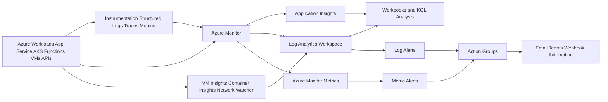

# How to Build a Monitoring System for Azure Workloads

## TL;DR

- Monitoring is not a bolt-on dashboard exercise. I treat it as a dedicated architecture layer with its own ingestion, storage, correlation, query, alerting, and visualization paths.
- In Azure, the core stack I recommend starts with **Azure Monitor**, **Log Analytics**, **Application Insights**, **Alerts**, and **Workbooks**, then adds workload-specific capabilities like **VM Insights**, **Container Insights**, and **Network Watcher** where they actually add signal.
- The anti-pattern I see most often is collecting everything, correlating nothing, and alerting on raw noise. That creates expensive telemetry and low operator trust.
- The right design starts with **critical flows**, **health states**, **correlation IDs**, and **retention/cost boundaries** before you turn on every checkbox in the portal.

## The Problem Worth Solving

Most Azure workloads are monitored badly, not because teams lack tools, but because they confuse telemetry collection with observability.

I’ve seen this pattern repeatedly across platform modernization work, startup landing zones, and support escalations: teams enable Application Insights, wire a few alerts, pin some charts to a dashboard, and assume they now “have monitoring.” Then the first real incident lands. API latency spikes across three services. A background worker dead-letters messages. AKS node pressure causes retries. App Service looks healthy at the resource layer, but the actual business transaction is failing. At that point, nobody wants another dashboard. They want causality.

In my experience, monitoring becomes valuable only when it answers four operational questions fast:

1. **Is the workload healthy right now?**
2. **If not, where exactly is the break?**
3. **What changed just before the break?**
4. **What should the team do next?**

That is why I design monitoring as its own system. Microsoft’s monitoring guidance is explicit about building a monitoring system, not just enabling tooling, and Azure Monitor is the central platform for collecting, analyzing, and acting on telemetry across Azure and hybrid environments. The platform brings together metrics, logs, traces, and events into a single observability model, with Application Insights as the APM layer and Log Analytics as the query engine for deeper analysis. See the Azure guidance here: [Azure Monitor overview](https://learn.microsoft.com/azure/azure-monitor/fundamentals/overview), [Monitoring design guide](https://learn.microsoft.com/azure/well-architected/design-guides/monitoring), and [Observability recommendations](https://learn.microsoft.com/azure/well-architected/operational-excellence/observability).

What breaks when you do this wrong?

- **429s and retry storms** go undetected because teams alert on CPU instead of request failure rate and dependency saturation.
- **Regional or downstream dependency failures** take too long to isolate because traces are not correlated across services.
- **Telemetry cost explodes** because verbose logs are retained forever in Analytics tables with no filtering strategy.
- **Incident response slows down** because every team has a different dashboard, different severity model, and different definition of healthy.
- **Executives get vanity dashboards**, while platform engineers still SSH into boxes or grep container logs to understand reality.

This matters most for:

- Cloud and AI architects designing Azure landing zones and shared platforms
- CTOs who want reliability without enterprise-grade monitoring sprawl
- Platform engineering teams standardizing telemetry across multiple product teams
- App teams running App Service, Functions, AKS, VMs, APIs, data services, or AI workloads in production

I’ve worked across cloud-native modernization and platform reliability initiatives where standardized observability materially improved operating outcomes. In one cloud-native modernization program, observability and zero-downtime deployment strategy helped move deployment frequency from weekly to daily, reduced MTTR from hours to minutes, and cut infrastructure cost by 40%. In a separate platform engineering initiative, standardizing observability across teams contributed to 100% CI/CD pipeline adoption and reduced deployment lead time by 65%. Those outcomes are exactly why I consider monitoring a first-class architecture concern, not an ops afterthought.

## Architecture Overview


The architecture I recommend has two stacks:

- the **functional stack**: apps, APIs, AKS clusters, VMs, data services, networks, deployment pipelines
- the **monitoring stack**: instrumentation libraries, Azure Monitor ingestion, Log Analytics storage, Application Insights tracing, alerts, workbooks, dashboards, and incident hooks

The key architectural decision is simple: **treat the monitoring stack as a shared platform with workload-specific extensions**.

### Reference architecture components

1. **Instrumentation in application code**
   - OpenTelemetry or native SDK instrumentation
   - Structured logs
   - Correlation IDs propagated across service boundaries
   - Custom business events for critical flows

2. **Resource and platform telemetry**
   - Azure Monitor Metrics for near-real-time time-series data
   - Resource logs and diagnostic settings routed into Log Analytics
   - Azure Service Health and Resource Health for platform incidents

3. **Application telemetry**
   - Application Insights for requests, dependencies, traces, exceptions, availability, and user flow analytics
   - Workspace-based configuration, not isolated legacy sprawl

4. **Central analytics plane**
   - Log Analytics workspace as the main correlation and query layer
   - KQL for cross-resource, cross-tier investigation
   - Table plan and retention strategy per data class

5. **Specialized insights**
   - VM Insights for machine-level performance and dependency maps
   - Container Insights for AKS cluster and pod-level telemetry
   - Network Watcher / Connection Monitor / Traffic Analytics for network visibility

6. **Action layer**
   - Azure Monitor Alerts
   - Action Groups
   - Automation hooks, ITSM integration, and incident routing

7. **Visualization**
   - Azure Workbooks for operator-focused drill-down
   - Azure Dashboards for shared summaries
   - Separate views for executives, service owners, and responders

### Data flow

1. Application code emits traces, logs, exceptions, dependency calls, and custom business events.
2. Azure resources emit platform metrics and diagnostic logs through Azure Monitor.
3. Telemetry is ingested into Azure Monitor and stored in Log Analytics and Application Insights-backed tables.
4. Correlation happens through operation IDs, trace IDs, span IDs, resource IDs, and shared dimensions like tenant, environment, region, deployment version, and service name.
5. KQL queries power investigations, trend analysis, SLO views, and workbook visualizations.
6. Alert rules evaluate metrics and logs against health-state thresholds.
7. Action Groups route notifications or trigger remediation.
8. Operators use Workbooks and dashboards to move from symptom to root cause.

### Critical path

The critical path is not “resource emits log.” The critical path is:

**request enters system -> trace propagates across dependencies -> telemetry lands in a queryable workspace -> alert fires on health state transition -> engineer can pivot from alert to correlated evidence in minutes**

That path is where most architectures fail.

To ground this in real practice, I’ve built production Azure systems with Application Insights monitoring and managed identity-first design, and I’ve also led platform work where standardized observability had to support multiple engineering teams instead of one app. My portfolio site itself is designed as a production-grade Azure reference architecture and includes Application Insights monitoring as part of the baseline platform.

Here is the reference flow in Mermaid:



For the official service guidance, I’d point readers to [Azure Monitor](https://learn.microsoft.com/en-us/azure/azure-monitor/overview), [Application Insights](https://learn.microsoft.com/en-us/azure/azure-monitor/app/app-insights-overview), [Log Analytics](https://learn.microsoft.com/en-us/azure/azure-monitor/log-query/log-query-overview), [Azure Workbooks](https://learn.microsoft.com/en-us/azure/azure-monitor/platform/workbooks-overview), and [Alerts](https://learn.microsoft.com/en-us/azure/azure-monitor/platform/alerts-overview).

<YouTubeEmbed videoId="eSutaPE80PM" title="What is Azure Monitor?" />

## Deep Dive: Instrumentation, Correlation, and Storage Design

This is the hard part. Not dashboarding. Not alert creation. The hard part is deciding **what telemetry exists**, **what context it carries**, and **where it lands**.

### 1) Instrumentation first, not portal first

If your application does not emit meaningful telemetry, Azure Monitor can only tell you that infrastructure exists, not that the workload works.

I recommend every production service emit at least:

- request duration
- request success/failure
- dependency duration and failure
- exception telemetry
- deployment version
- environment
- tenant or customer segment where appropriate
- correlation ID / trace ID
- business events for critical operations

For example, in .NET with Application Insights and OpenTelemetry-compatible patterns, I care more about the dimensions than the raw event count.

```csharp
using Microsoft.ApplicationInsights;
using Microsoft.ApplicationInsights.Extensibility;
using System.Collections.Generic;

var telemetry = new TelemetryClient(TelemetryConfiguration.CreateDefault());

// Track a critical business event with dimensions that support incident triage
telemetry.TrackEvent(
    "CheckoutCompleted",
    new Dictionary<string, string>
    {
        ["service"] = "checkout-api",
        ["environment"] = "prod",
        ["region"] = "eastus",
        ["deploymentVersion"] = "2026.04.26.1",
        ["tenantId"] = "contoso-enterprise",
        ["correlationId"] = Guid.NewGuid().ToString()
    },
    new Dictionary<string, double>
    {
        ["cartValue"] = 249.99,
        ["items"] = 3
    });
```

The gotcha here is that many teams emit logs with free-text messages and no dimensions. That feels easy on day one and becomes unqueryable by month three.

### 2) Structured logging beats clever prose

I am opinionated on this: **plain English logs are for humans, structured logs are for operations**.

Bad log:
- “Database call slow again, maybe timeout?”

Good log:
- eventName=DependencyTimeout service=orders-api dependency=sql region=eastus operationId=... durationMs=8120 retryCount=3

If you don’t standardize fields like `service`, `environment`, `operationId`, `deploymentVersion`, and `tenantId`, your cross-service analysis will collapse under its own inconsistency.

Microsoft’s reliability guidance explicitly recommends structured logging and correlation IDs across service boundaries for tracing failures through multi-service transactions. That recommendation aligns with what I’ve seen in production support: when correlation is missing, teams burn time arguing over whose dashboard is “correct” instead of finding the fault domain.

### 3) Centralize telemetry, but don’t centralize blindly

A Log Analytics workspace is the right default analytics sink for most Azure estates, but workspace design is an architectural decision, not a checkbox.

My rule of thumb:

- **Single workspace per small or medium workload estate** when governance, access, and data residency are simple
- **Multiple workspaces** when you have strong environment isolation, sovereignty requirements, separate operating teams, or billing boundaries
- **One Application Insights resource per workload per environment** to avoid mixing telemetry across dev, test, and prod

That last point is straight out of Microsoft’s Application Insights architecture guidance, and I strongly agree with it. Shared telemetry across environments causes misreads, noisy baselines, and incident confusion.

### 4) Example Azure CLI baseline

Here is a simple baseline to create a workspace-based monitoring setup.

```bash
# Create a Log Analytics workspace
az monitor log-analytics workspace create \
  --resource-group prod-observability-rg \
  --workspace-name law-prod-eastus \
  --location eastus

# Create a workspace-based Application Insights resource
az monitor app-insights component create \
  --app appi-checkout-prod \
  --location eastus \
  --resource-group prod-observability-rg \
  --workspace law-prod-eastus
```

And here is how I’d wire diagnostic settings from an App Service into Log Analytics.

```bash
resourceGroup="prod-app-rg"
location="eastus"
workspaceName="law-prod-eastus"
webAppName="checkout-api-prod"
diagName="${webAppName}-diagnostics"
SUBSCRIPTION_ID=$(az account show --query id -o tsv)

workspaceId=$(az monitor log-analytics workspace show \
  --resource-group "$resourceGroup" \
  --workspace-name "$workspaceName" \
  --query id -o tsv)

az monitor diagnostic-settings create \
  --name "$diagName" \
  --resource "/subscriptions/$SUBSCRIPTION_ID/resourceGroups/$resourceGroup/providers/Microsoft.Web/sites/$webAppName" \
  --workspace "$workspaceId" \
  --logs '[{"category":"AppServiceConsoleLogs","enabled":true},{"category":"AppServiceHTTPLogs","enabled":true}]' \
  --metrics '[{"category":"AllMetrics","enabled":true}]'
```

For Key Vault, Storage, Event Hubs, and other services, the exact categories vary, but the pattern is the same: route logs and metrics intentionally, not indiscriminately.

### 5) Correlation and KQL are where observability becomes real

This is the difference between “I have telemetry” and “I can investigate incidents.”

A basic KQL correlation pattern I use:

```kusto
let windowStart = ago(30m);
requests
| where timestamp > windowStart
| where cloud_RoleName == "checkout-api"
| project operation_Id, requestName=name, requestDuration=duration, success, resultCode, timestamp
| join kind=leftouter (
    dependencies
    | where timestamp > windowStart
    | project operation_Id, dependencyTarget=target, dependencyType=type, dependencyDuration=duration, depSuccess=success
) on operation_Id
| join kind=leftouter (
    exceptions
    | where timestamp > windowStart
    | project operation_Id, exceptionType=type, outerMessage=outerMessage
) on operation_Id
| order by timestamp desc
```

This gives responders one row shape that connects requests, dependencies, and exceptions around the same operation ID. That is how you reduce MTTR.

Another practical query I like for deployment correlation:

```kusto
traces
| where timestamp > ago(6h)
| where customDimensions["deploymentVersion"] != ""
| summarize count() by tostring(customDimensions["deploymentVersion"]), bin(timestamp, 15m)
| render timechart
```

If latency doubles exactly when a new deployment version becomes dominant, I don’t need a war room to know where to look next.

### 6) Alert on state transitions, not raw noise

Most alerting systems fail because they alert on symptoms with no health model.

I recommend defining health states per critical flow:

- **Healthy**: p95 latency < 300 ms, error rate < 0.5%
- **Degraded**: p95 latency 300–800 ms or error rate 0.5–2%
- **Unhealthy**: p95 latency > 800 ms or error rate > 2% for 5 minutes

Then create alerts against those states.

Example metric alert:

```bash
az monitor metrics alert create \
  --name "checkout-5xx-rate-high" \
  --resource-group prod-observability-rg \
  --scopes "/subscriptions/<sub-id>/resourceGroups/prod-app-rg/providers/Microsoft.Web/sites/checkout-api-prod" \
  --condition "count Http5xx > 20 where Instance != '*'" \
  --window-size 5m \
  --evaluation-frequency 1m \
  --severity 2 \
  --description "Checkout API 5xx volume exceeded threshold"
```

I also recommend Action Groups with severity-based routing:

- Sev0/1 -> paging + incident bridge
- Sev2 -> team channel + ticket
- Sev3 -> backlog or review queue

The mistake I see often is routing everything to everyone. That trains teams to ignore alerts.

### 7) Visualization: operators need drill-down, leaders need summaries

Use **Azure Workbooks** for operators because they support parameterized drill-down, linked queries, conditional formatting, and richer diagnostics journeys.

Use **Azure Dashboards** sparingly for summary views.

If you show a CTO the same dashboard you show an on-call engineer, one of them is getting the wrong information.

A practical workbook hierarchy I use:

- Executive: availability, latency, incident count, release health
- Service owner: p95 latency, dependency failure, top exceptions, per-region health
- Platform team: workspace ingestion, DCR coverage, agent health, alert fire volume
- Incident responder: last 30 minutes correlated view with request-dependency-exception pivots


## What I Got Wrong the First Time

Early in my architecture work, I treated monitoring maturity as a linear tooling rollout.

Step 1: enable Application Insights.  
Step 2: send logs to Log Analytics.  
Step 3: add alerts.  
Step 4: build dashboards.

That sequence is tidy, but incomplete.

The failure mode I hit was predictable in hindsight: **we had lots of telemetry, but no consistent incident narrative**.

In one modernization-style environment, we could see pod restarts, API failures, and dependency latency, but we could not reliably tie them back to a single business transaction. Different teams had different naming conventions. Some logs had operation IDs, some didn’t. Diagnostic settings were enabled unevenly. Alert thresholds were copied from samples instead of learned from baselines. The result was classic operational friction: too many alerts, too little confidence.

How do you detect this in production?

- Mean time to identify the fault domain stays high even though telemetry volume is high
- Engineers pivot between 4–6 tools for a single incident
- Postmortems contain phrases like “we lacked visibility” despite terabytes of logs
- Alert suppression rules keep growing because teams don’t trust the signals
- You can’t answer “which deployment version introduced this pattern?” in under five minutes

The fix was not “collect more.” The fix was:

- standardize telemetry schema
- require correlation IDs
- separate health signals from audit signals
- create service-specific health models
- build responder workbooks around investigation flow, not org charts
- cut low-value ingestion at the source

That lesson lines up with Microsoft’s reliability guidance: define critical flows, health states, and monitoring strategy before wiring alerts, and use telemetry gathered during incidents to continuously refine the health model.

This is also where my support background shaped my bias. Resolving 700+ Azure production issues makes one thing very clear: noisy telemetry is not observability. Fast isolation is.

## Performance & Cost Considerations

Monitoring architecture has performance and cost curves. Ignore them and the platform becomes either too expensive or too slow to help.

### Baseline expectations

For most Azure application workloads, I expect the stack to divide like this:

- **Metrics** for fast thresholding and alerting
- **Logs** for diagnostic detail
- **Traces** for transaction correlation
- **Workbooks/KQL** for investigations and trending

My bias is:
- metrics answer **“is something wrong?”**
- traces answer **“where in the flow is it wrong?”**
- logs answer **“why is it wrong?”**

### Cost levers that matter

1. **Ingestion volume**
   - biggest driver of Log Analytics cost in many estates
   - debug-level logging in production is often the silent killer

2. **Retention**
   - not all tables need the same retention
   - incident analysis logs might need 30–90 days hot
   - compliance or audit data may need archive strategy

3. **Table plans**
   - Analytics vs Basic changes both query capability and economics
   - don’t place high-correlation operational data into cheaper plans if it breaks investigations

4. **Sampling**
   - useful for very high-throughput traces
   - dangerous if you sample blindly and lose rare failure signals

5. **Workload-specific logs**
   - AKS and network flow logs can get expensive fast
   - capture them intentionally, especially on noisy clusters

Microsoft explicitly calls out the cost trade-off of centralized diagnostic logging and retention design. I agree with that framing. Centralize, but budget with intent.

### Where this solution breaks

This architecture starts to strain when:

- you ingest verbose container logs from large AKS estates without filtering
- you run multi-region regulated workloads with conflicting residency requirements
- every team creates ad hoc custom dimensions, making the schema impossible to query consistently
- you depend only on logs for alerting and ignore metrics for fast detection
- you keep one giant shared workspace across every environment and business unit

For AKS specifically, network and container telemetry can become high-volume enough to cause throttling or log loss if not managed carefully. That is one reason I do not recommend turning on every cluster signal by default.

### Cost optimization recommendations I actually use

- Keep **prod** telemetry richer than lower environments
- Sample high-volume traces, but exempt error paths where possible
- Send low-value verbose diagnostics to cheaper stores or short retention
- Use workbook-driven investigation paths to reduce “query everything” behavior
- Standardize diagnostic settings in IaC so teams don’t overcollect inconsistently
- Review top tables by ingestion monthly; if you don’t do this, your monitoring bill will drift upward quietly

## When NOT to Use This

I’m strongly in favor of building a proper monitoring system, but not every workload needs the full pattern on day one.

Do **not** use the full reference architecture if:

- you have a single internal app with low criticality and one small engineering team
- the workload has no meaningful distributed dependencies
- you are still in proof-of-concept stage and don’t yet know the critical flows
- your main need is security event collection rather than operational observability
- your platform team cannot yet support KQL, alert ownership, or schema governance

If your workload looks like this, use a lighter version:

- one Log Analytics workspace
- one Application Insights resource per environment
- 5–10 curated alerts
- one operator workbook
- one executive dashboard
- no fancy topology story until the workload earns it

Another anti-pattern to avoid: using **Azure Dashboards as your primary observability product**. Dashboards are presentation. Monitoring is system design.

If your primary challenge is deep SRE practice, SLO math, or multi-cloud telemetry standardization, you might choose an Azure-integrated but more OpenTelemetry-first pattern with external analysis tooling. But even then, Azure Monitor should usually remain part of the platform telemetry path for Azure-native resources.

My advice is simple: **don’t overbuild the views before you standardize the signals**.

## Key Takeaways

- Treat monitoring as a **dedicated architecture stack**, not a post-deployment task.
- Start with **critical flows, health states, and correlation IDs** before choosing alert thresholds.
- Use **Azure Monitor + Log Analytics + Application Insights** as the core, and add **VM Insights, Container Insights, and Network Watcher** only where they improve diagnosis.
- Standardize **structured logging dimensions** across services, environments, and deployments. This is the foundation of usable KQL and fast MTTR.
- Optimize for **signal quality over telemetry volume**. Expensive noisy logs are worse than a smaller, well-correlated dataset.
- Adopt a reference architecture, avoid the anti-pattern of dashboard-first monitoring, and rethink tool choice if your current stack cannot connect technical signals to operational outcomes.

If I were advising a platform team tomorrow, I’d ask them to do three things first:
1. define the top 5 critical business and platform flows,
2. standardize telemetry schema and correlation,
3. deploy one reusable Azure monitoring baseline through IaC.

That is the point where monitoring starts behaving like architecture instead of admin work.
