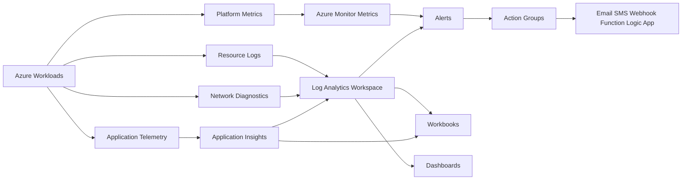

# How to Build a Monitoring System for Azure Workloads

## TL;DR

- Monitoring is not a portal feature you switch on at the end. I treat it as a separate architecture plane with its own data flows, retention rules, access model, and cost envelope.
- For most Azure workloads, the right baseline is: **Azure Monitor + Log Analytics workspace + Application Insights + diagnostic settings + alerts + Workbooks**. Then add **VM Insights**, **Container Insights**, and **Network Watcher** only where the workload needs deeper visibility.
- The most common anti-pattern I see is collecting everything, correlating nothing, and alerting on symptoms instead of business impact. That gives you high spend, low trust, and poor incident response.
- If you want monitoring to scale, design for four layers from day one: **instrumentation**, **collection/storage**, **correlation/analysis**, and **visualization/action**.

## The Problem Worth Solving

Most teams still bolt monitoring on after the workload is already live. That is usually where the trouble starts.

In my experience, the failure is rarely “we had no telemetry at all.” The real failure is more subtle: metrics exist in one place, application traces in another, platform logs are either missing or too noisy, and nobody can tie a customer issue to a concrete execution path in under 15 minutes. At that point, monitoring is just expensive decoration.

I treat monitoring as a first-class architecture system. The functional stack serves the workload. The monitoring stack observes the workload. Those are different responsibilities and they need different design decisions. Microsoft’s Well-Architected guidance makes the same point: build a dedicated monitoring system that observes infrastructure, application behavior, and operational processes rather than treating monitoring as an afterthought.

This matters right now for a few reasons:

- Azure estates are more distributed than they were even two years ago: App Service, Functions, containers, managed databases, AI endpoints, private networking, CI/CD automation, and external SaaS dependencies.
- Teams are shipping faster. If your deployment frequency goes from weekly to daily, weak observability stops being an inconvenience and becomes a reliability risk.
- Cost is no longer secondary. Azure Monitor Logs ingestion is often the biggest monitoring cost component, so bad telemetry design becomes a FinOps problem quickly.

I’ve seen this play out repeatedly. In my portfolio work, I built a production-grade Azure portfolio site with Application Insights monitoring, managed identity, CI/CD, and a documented architecture as a reference implementation. In another modernization project on AKS, introducing observability and deployment discipline helped move deployment frequency from weekly to daily, reduced mean time to recovery from hours to minutes, and cut infrastructure cost by 40%.

This affects:

- **Cloud and AI architects** designing multi-service workloads
- **CTOs** who care about uptime, team efficiency, and cloud spend
- **Platform engineers** standardizing telemetry across teams
- **App teams** who need real root-cause analysis, not vanity dashboards

What breaks when you do this wrong?

- You miss platform logs because diagnostic settings were never enabled.
- You get flooded with alerts because every CPU spike pages someone.
- You cannot correlate a failed API request to a dependency call, database issue, or network path.
- You retain verbose logs forever and wonder why the Azure bill keeps climbing.
- During incidents, the first 20 minutes are spent asking “which dashboard is the right one?”

If your system starts throwing intermittent 5xx responses at 800 to 1,000 RPS and you cannot answer **which operation**, **which dependency**, **which deployment**, and **which region** within a few minutes, your monitoring architecture is incomplete.

## Architecture Overview


The architecture I recommend has a simple principle: **separate the workload plane from the observability plane, but connect them through consistent telemetry contracts**.

At a high level:

1. **Applications and services emit telemetry**
   - Application code emits traces, requests, dependencies, exceptions, and custom events through Application Insights and OpenTelemetry.
   - Azure resources emit platform metrics and resource logs through Azure Monitor.
   - VMs, AKS clusters, and network components emit deeper operational data through Azure Monitor Agent, Container Insights, VM Insights, Prometheus integration where needed, and Network Watcher. Microsoft’s Azure Monitor architecture explicitly positions Azure Monitor as the central data platform for logs, metrics, application telemetry, and Prometheus-style signals.

2. **Telemetry lands in the right sink**
   - Near-real-time time-series signals go to **Metrics**
   - Searchable operational and diagnostic records go to **Log Analytics**
   - Application traces and request/dependency data go through **Application Insights**, ideally workspace-based

3. **Correlation happens at query and trace level**
   - Operation IDs, trace IDs, request IDs, user/session identifiers, deployment metadata, and environment tags are attached to telemetry.
   - Cross-service analysis happens through KQL in Log Analytics and Application Insights-backed logs.

4. **Actioning and visualization sit on top**
   - Alerts route through **Azure Monitor Alerts + Action Groups**
   - Investigative views live in **Workbooks**
   - Executive or operational rollups live in **Azure Dashboards**
   - Service-specific views come from **VM Insights**, **Container Insights**, and **Network Watcher**

The critical path is this:

**Instrumentation quality -> diagnostic coverage -> correlation identifiers -> actionable alerts**

If you get the first two right but skip correlation, you collect noise.  
If you get correlation right but alert on the wrong signals, you still wake people up for nothing.

Here is the logical flow I use.



The official design guidance is aligned with this pattern: Azure Monitor is the collection and response platform, Log Analytics is the central log analysis engine, Application Insights is the APM layer, Workbooks provide deep analysis views, and specialized insights extend the core platform for VMs, containers, and networks.

## Deep Dive: Instrumentation, Correlation, and Telemetry Design

This is the part most teams underinvest in.

Tools do not create observability. Instrumentation does.

If your code emits anonymous exceptions, untagged dependency calls, and inconsistent custom properties, the rest of the stack cannot save you. I recommend designing telemetry the same way you design APIs: define schema, cardinality boundaries, naming conventions, ownership, and retention.

### 1) Instrumentation: start with contracts, not SDK defaults

For application workloads, use Application Insights with OpenTelemetry where possible. Microsoft now positions Application Insights as an OpenTelemetry-enabled Azure Monitor feature for application performance monitoring.

My minimum telemetry contract per request is:

- `traceId`
- `operationId`
- `serviceName`
- `serviceVersion`
- `environment`
- `tenantId` or customer segment if applicable
- `correlationId` from upstream gateway
- business dimensions like `orderId`, `workflowId`, or `caseId` only when cardinality is controlled

What I do **not** log freely:

- PII
- raw prompts or payloads without redaction rules
- high-cardinality junk like full URLs with random query strings
- debug-level logs in production without time-bound purpose

A practical Node.js example with Azure Monitor OpenTelemetry:

```bash
npm install @azure/monitor-opentelemetry @opentelemetry/api express
```

```javascript
import express from "express";
import { useAzureMonitor } from "@azure/monitor-opentelemetry";
import { context, trace } from "@opentelemetry/api";

useAzureMonitor({
  azureMonitorExporterOptions: {
    connectionString: process.env.APPLICATIONINSIGHTS_CONNECTION_STRING
  },
  enableLiveMetrics: true
});

const app = express();

app.get("/healthz", (_req, res) => {
  res.status(200).send("ok");
});

app.get("/orders/:id", async (req, res) => {
  const span = trace.getTracer("orders-api").startSpan("get-order");
  try {
    const orderId = req.params.id;
    span.setAttribute("app.order_id", orderId);
    span.setAttribute("deployment.environment", process.env.NODE_ENV || "prod");

    // Simulate dependency work
    await new Promise(resolve => setTimeout(resolve, 120));

    res.json({ id: orderId, status: "processed" });
  } catch (err) {
    span.recordException(err);
    res.status(500).json({ error: "unexpected_failure" });
  } finally {
    span.end();
  }
});

app.listen(3000, () => {
  console.log("Orders API listening on port 3000");
});
```

The gotcha here is cardinality. If you stamp every telemetry item with user-level or request-level fields that explode uniqueness, your queries slow down and your data loses analytical value.

### 2) Collection: enable platform telemetry deliberately

A lot of Azure teams assume the portal overview equals observability. It does not.

Azure Monitor automatically collects some platform metrics and activity logs, but detailed resource logs require **diagnostic settings** on the resource. Azure’s documentation is explicit about this: richer monitoring data from Azure resources typically requires diagnostic settings and additional collection configuration.

For example, on App Service or other PaaS resources, I usually provision:

- a Log Analytics workspace
- a workspace-based Application Insights resource
- diagnostic settings forwarding logs and metrics
- naming conventions that reflect environment and landing zone

```bash
resourceGroup="rg-monitoring-prod"
location="eastus"
workspaceName="law-prod-eastus-01"
appInsightsName="appi-orders-prod-01"
webAppName="app-orders-prod-01"
subscriptionId=$(az account show --query id -o tsv)

workspaceId=$(az monitor log-analytics workspace create \
  --resource-group $resourceGroup \
  --workspace-name $workspaceName \
  --location $location \
  --query id -o tsv)

az monitor app-insights component create \
  --app $appInsightsName \
  --location $location \
  --resource-group $resourceGroup \
  --workspace $workspaceName
```

Then wire diagnostic settings:

```bash
az monitor diagnostic-settings create \
  --name "send-to-law" \
  --resource "/subscriptions/$subscriptionId/resourceGroups/$resourceGroup/providers/Microsoft.Web/sites/$webAppName" \
  --workspace $workspaceId \
  --logs '[
    {"category":"AppServiceHTTPLogs","enabled":true},
    {"category":"AppServiceConsoleLogs","enabled":true},
    {"category":"AppServiceAppLogs","enabled":true},
    {"category":"AppServiceAuditLogs","enabled":true}
  ]' \
  --metrics '[{"category":"AllMetrics","enabled":true}]'
```

For VMs and servers, use Azure Monitor Agent and VM Insights. For AKS, use Container Insights and, where appropriate, managed Prometheus support in Azure Monitor. Microsoft’s enterprise monitoring architecture calls out Azure Monitor Agent, Application Insights, Logs ingestion API, Workbooks, and managed Prometheus as core components of the observability platform.

### 3) Correlation: where monitoring becomes useful

This is the layer that separates “we have logs” from “we can investigate.”

For distributed workloads, I want to answer these in one query session:

- Which request path failed?
- Which downstream dependency was slow?
- Was there a deployment in the preceding 15 minutes?
- Was the issue isolated to one node, one availability zone, one region, or one tenant?
- Did network or platform symptoms precede the app failure?

A simple KQL query to correlate request failures with dependency pain:

```kusto
let failedRequests =
    requests
    | where timestamp > ago(30m)
    | where success == false
    | project operation_Id, requestName=name, requestDuration=duration, resultCode, cloud_RoleName, timestamp;
let slowDependencies =
    dependencies
    | where timestamp > ago(30m)
    | where duration > 1000ms
    | project operation_Id, dependencyTarget=target, dependencyName=name, dependencyDuration=duration, dependencySuccess=success;
failedRequests
| join kind=leftouter slowDependencies on operation_Id
| order by timestamp desc
```

This is why I push teams to standardize `operation_Id` propagation across services. Without it, cross-tier analysis degrades into timestamp guesswork.

### 4) Visualization: build for two audiences

I usually create two classes of views:

**Operational views**
- On-call dashboard
- Service health workbook
- Dependency failure workbook
- Top error signatures
- SLO burn or error budget approximation if the team is mature enough

**Leadership views**
- Availability trend
- P95/P99 latency
- Incident count by service
- Mean time to detect
- Mean time to recover
- Cost of telemetry by workload

Workbooks are where I spend most of my time because they support investigation better than static dashboards. Azure documentation positions Workbooks as the flexible analysis canvas for deep drill-down and custom visual reports.

## What I Got Wrong the First Time

The first time I built a “complete” monitoring setup for a distributed workload, I over-collected and under-modeled.

I had metrics, logs, traces, dashboards, and alerts. On paper it looked mature. In practice, it was noisy and expensive. The root problem was that I had not made enough decisions up front about:

- table plans
- retention
- which logs were operationally valuable
- which custom dimensions were actually worth indexing
- which alerts mapped to customer impact

I see variants of this anti-pattern often: teams ingest every diagnostic category into a central workspace because it feels safer. A month later, nobody trusts the alerts, the KQL queries are messy, and log ingestion becomes a meaningful part of the Azure bill. Microsoft’s cost guidance is very clear that log ingestion is often the largest Azure Monitor cost driver and that data configuration choices heavily influence spend.

How to detect this in production:

- ingestion jumps week over week without a matching reliability benefit
- workbooks take too long to load
- on-call ignores alerts because too many are low signal
- post-incident reviews keep saying “insufficient context”
- teams export data to spreadsheets because native analysis is too cluttered

The fix was architectural, not operational:

1. Redefine telemetry classes:
   - health signals
   - investigative signals
   - audit signals
   - debug signals

2. Apply different retention and table strategies

3. Cut custom dimensions that had no query value

4. Move from per-resource alert sprawl to service-level alert design

5. Standardize workbook templates across teams

That same thinking is why I’m opinionated about observability in platform modernization. In my AKS modernization work, standardizing observability alongside GitOps and deployment practices helped reduce MTTR from hours to minutes. In platform engineering work, standardized observability was part of reducing onboarding from 3 days to 2 hours and driving CI/CD adoption to 100% of teams.

## Performance & Cost Considerations

This is the part architects often skip, and it is where bad designs get punished.

### Baseline performance assumptions

For most Azure production workloads, I think in three telemetry lanes:

- **Metrics** for low-latency health and alerting
- **Logs** for diagnostics and forensic detail
- **Traces** for request-path correlation

Metrics are the cheapest and fastest way to alert on infrastructure and service-level behavior. Logs are the richest but most likely to drive cost. Traces are essential for app debugging but can become expensive if every request is sampled at 100% under heavy traffic.

A practical baseline:

- At **100 RPS**, full tracing may still be manageable for a critical API if retention is controlled.
- At **1,000+ RPS**, always-on 100% sampling is usually a bad default unless the workload is narrow and high-value.
- For noisy container platforms, network flow logs can explode in volume quickly; Azure’s AKS network monitoring guidance explicitly warns about substantial log volume, throttling, and log loss if not tuned.

### Cost levers that actually matter

The biggest levers are usually:

1. **Ingestion volume**
2. **Retention duration**
3. **Table plan choice**
4. **Sampling**
5. **Number of duplicated sinks**
6. **Verbose diagnostic categories enabled by default**

Azure Monitor pricing is regional and logs are billed largely by ingestion, retention, and export. Microsoft’s cost documentation repeatedly emphasizes that ingestion is the biggest component for many customers.

My practical recommendations:

- Keep one central workspace per environment or per compliance boundary, not one per resource.
- Use separate workspaces only when compliance, tenancy isolation, or operational ownership justifies the trade-off.
- Sample application traces intelligently.
- Put noisy debugging tables on lower-cost plans where query patterns allow it.
- Create daily budget alerts around the monitoring resource group, not just the product workload.
- Review top-ingesting tables monthly.

Example: create an action group and a scheduled query alert.

```bash
resourceGroup="rg-monitoring-prod"
workspaceResourceId="/subscriptions/<sub-id>/resourceGroups/rg-monitoring-prod/providers/Microsoft.OperationalInsights/workspaces/law-prod-eastus-01"

az monitor action-group create \
  --name "ag-platform-oncall" \
  --resource-group $resourceGroup \
  --short-name "platcall" \
  --email-receiver name="PlatformOnCall" email="platform-oncall@contoso.com"

az monitor scheduled-query create \
  --name "High 5xx Error Rate" \
  --resource-group $resourceGroup \
  --scopes $workspaceResourceId \
  --condition "count > 25" \
  --condition-query "requests | where TimeGenerated > ago(5m) | where toint(resultCode) >= 500 | count" \
  --description "Triggers when 5xx volume exceeds threshold in 5 minutes" \
  --evaluation-frequency "5m" \
  --window-size "5m" \
  --severity 2 \
  --action-groups "/subscriptions/<sub-id>/resourceGroups/rg-monitoring-prod/providers/Microsoft.Insights/actionGroups/ag-platform-oncall"
```

Also use dynamic thresholds selectively. They can reduce alert tuning effort, but I do not recommend them as a blanket substitute for understanding the workload. Microsoft supports dynamic thresholds for relevant metrics and, in some cases, log-query-based scenarios, but they work best where historical patterns are meaningful and stable.

### When does this architecture break?

It does not “break” all at once. It degrades in predictable ways:

- **At high scale**: log ingestion cost climbs faster than value if you do not sample and prune.
- **Across regions**: correlation becomes harder if naming, tagging, and workspace strategy are inconsistent.
- **Across teams**: every team creates its own alerts and dashboards, and your platform loses standardization.
- **In AI-heavy workloads**: prompt/response telemetry creates privacy, size, and cardinality problems if ungoverned.

## When NOT to Use This

I recommend this architecture for most Azure-hosted enterprise workloads, but not universally.

Do **not** use the full stack if:

- your app is a small internal tool with low criticality and one service boundary
- your workload is ephemeral and cost sensitivity is extreme
- your team does not have the operational maturity to maintain custom dashboards, queries, and alert tuning
- you only need basic uptime checks and platform metrics

If your workload looks like this:

- one App Service
- one database
- low traffic
- one team
- tolerant to short interruptions

Then don’t over-engineer it. Start with:

- Azure Monitor metrics
- basic Application Insights
- two or three critical alerts
- one workbook
- a short retention period

If your workload is **AKS-heavy**, add Container Insights and Prometheus support where it helps, but be careful with log volume. If it is **network-sensitive**, prioritize Network Watcher connection monitoring and flow-level analysis. If it is **VM-centric**, VM Insights is often a better first investment than building custom workbook sprawl.

The bigger anti-pattern I want readers to avoid is this: **buying more monitoring features instead of designing a monitoring architecture**.

Tools do not fix weak signal design.

## Key Takeaways

- Design monitoring as a **separate architecture plane** with its own data flows, storage, access controls, and cost model.
- Start with four layers: **instrumentation**, **collection/storage**, **correlation/analysis**, and **visualization/action**.
- My default Azure baseline is **Azure Monitor + Log Analytics + Application Insights + diagnostic settings + alerts + Workbooks**, then add VM, container, or network insights only when justified.
- Correlation IDs, environment tags, service version metadata, and disciplined custom dimensions matter more than having 50 dashboards.
- The fastest way to waste money is to ingest everything. The fastest way to waste engineering time is to alert on everything.
- If you want a reliable monitoring system, optimize for **investigation speed**, **signal quality**, and **cost control** together.

If you’re rethinking your current setup, my advice is simple: adopt a reference architecture, remove the anti-pattern of unmanaged log sprawl, and choose monitoring tools based on the workload’s failure modes rather than what is easiest to enable in the portal.

<YouTubeEmbed videoId="QmsbSMp41As" title="Azure Monitor: Observability from code to cloud | BRK127" />

<YouTubeEmbed videoId="eSutaPE80PM" title="What is Azure Monitor?" />
